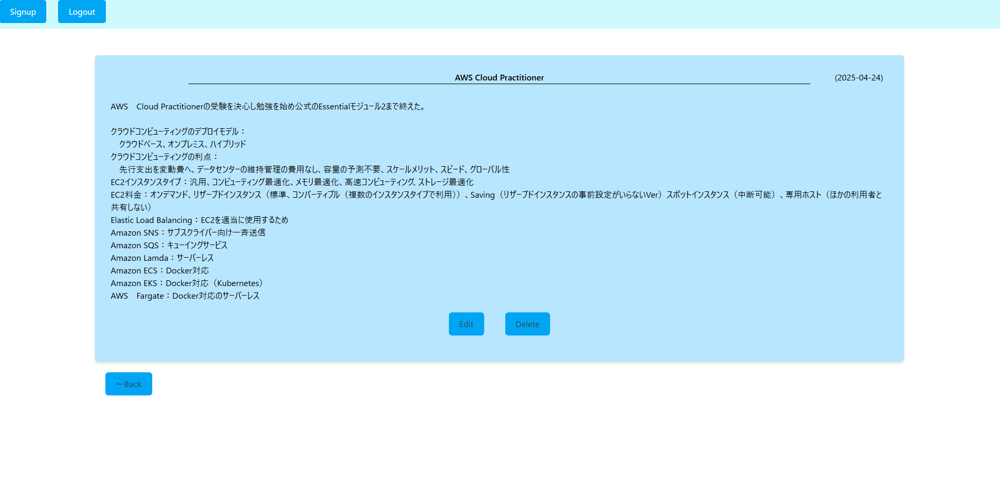
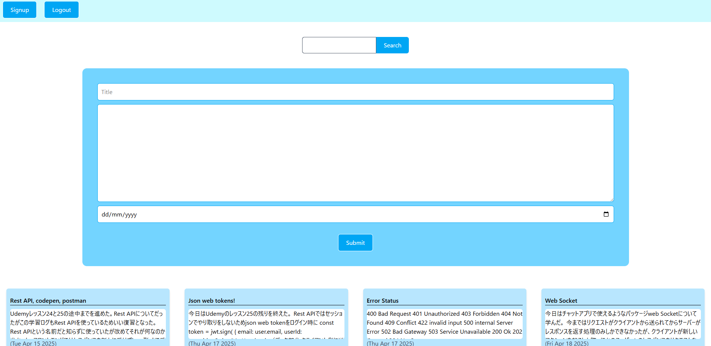

# 学習ログアプリ

学習した内容を記録・管理できるウェブアプリです。

## 使用技術
- Frontend: React
- Backend: Node.js / Express
- Database: MongoDB

## 主な機能
- ユーザーの登録・ログイン・パスワードの変更
- 学習ログの登録・編集・削除
- キーワードでの絞り込み検索

## 今後の改善予定
- ログをプライベート・オープンと選べるようにする
- ログにタグをつけて絞り込み検索で使えるようにする

